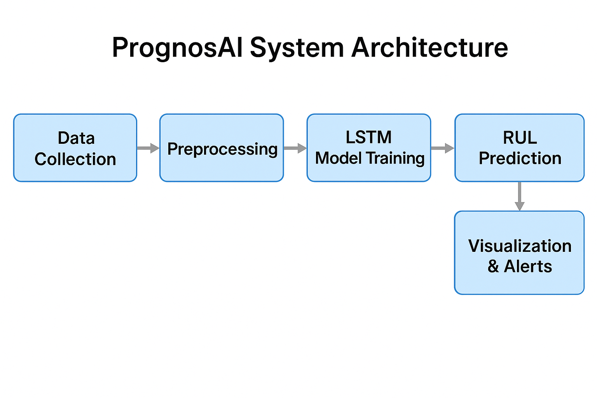
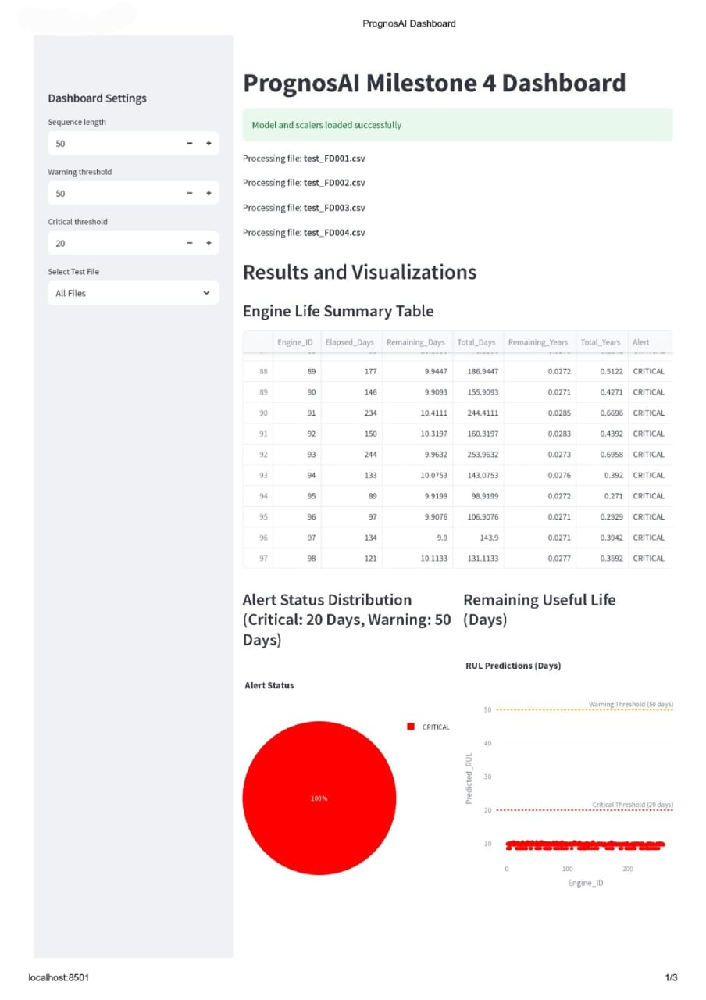
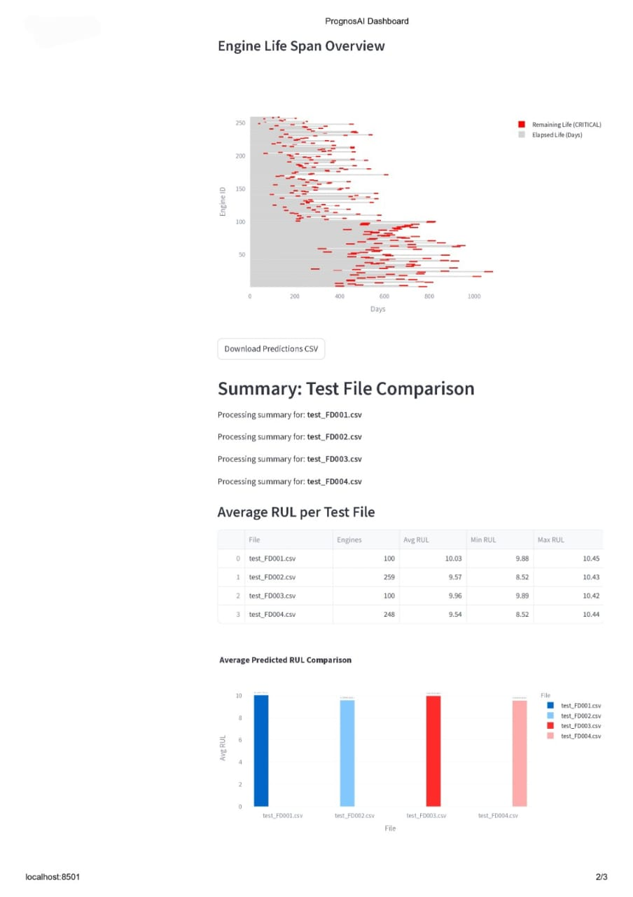
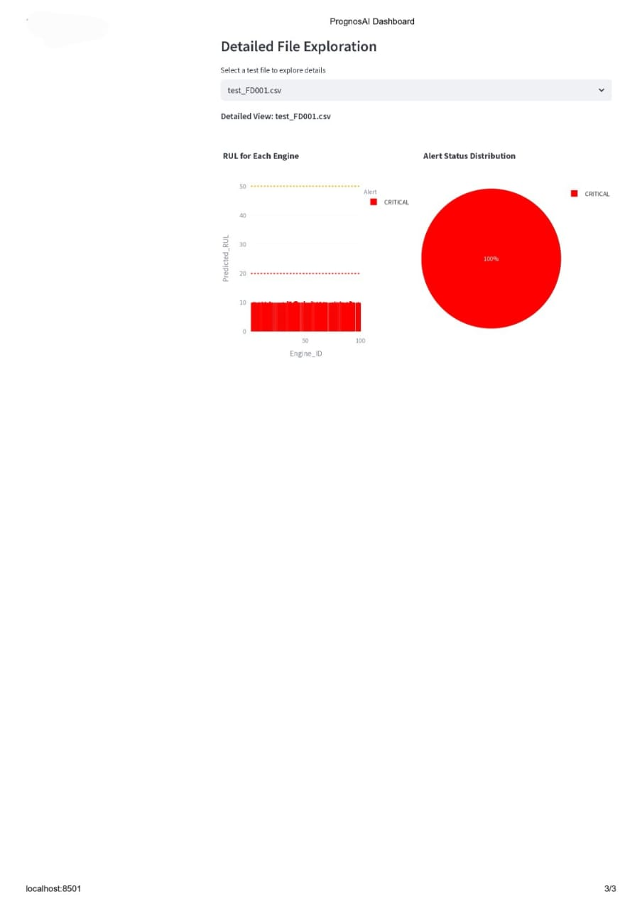

# PrognosAI: AI-Driven Predictive Maintenance System Using Time-Series Sensor Data

**Prepared by:** Durga Veera Prasad V  
**Dataset:** NASA Turbofan Jet Engine (CMAPSS)

---

## Abstract

PrognosAI is an AI-driven predictive maintenance framework that estimates the Remaining Useful Life (RUL) of turbofan jet engines using time-series sensor data.  
The system integrates deep learning, dynamic alerting, and visualization dashboards to deliver interpretable insights and optimize maintenance planning.

---

## 1. Introduction and Objectives

Predictive maintenance seeks to forecast machinery failures before they occur.  
PrognosAI applies deep-learning-based RUL estimation to NASA’s CMAPSS dataset.

### Objectives
- Develop an LSTM model for accurate RUL prediction  
- Implement dynamic alerts for maintenance scheduling  
- Provide a real-time visualization dashboard

---

## 2. Dataset Description

- Source: NASA CMAPSS Dataset  
- Features: 21 sensors and 3 operational settings  
- Units: Multiple engine units (FD001–FD004)  
- Structure: Training and test files include degradation sequences  
- Target: Remaining Useful Life (RUL)

---

## 3. System Architecture

**Figure 1: PrognosAI System Architecture**  
Data Collection → Preprocessing → Feature Scaling → LSTM Model Training → RUL Prediction → Visualization and Alerts

### Workflow Stages

#### 1. Data Collection
- Collected multivariate sensor data from the NASA CMAPSS dataset.  
- Included readings from multiple engines across operational cycles.  
- Captured temperature, pressure, and performance-related sensor values.

#### 2. Preprocessing
- Cleaned and filtered data to remove noise, missing values, and irrelevant features.  
- Normalized operational settings and generated fixed-length time windows for LSTM input.

#### 3. Feature Scaling
- Applied MinMaxScaler to normalize sensor values between 0–1.  
- Ensured stable and efficient neural network training.

#### 4. LSTM Model Training
- Used LSTM to learn temporal dependencies in sensor time-series data.  
- Modeled engine degradation patterns and generalized well to unseen data.

#### 5. RUL Prediction
- Predicted Remaining Useful Life (RUL) in operational cycles.  
- Supported proactive maintenance scheduling and decision-making.

#### 6. Visualization and Alerts
- Implemented a Streamlit dashboard for displaying predictions and alerts.  
- Provided interactive charts and alert notifications for timely maintenance actions.

---

## 4. Milestone 1 – Data Preparation

- Loaded CMAPSS datasets  
- Calculated RUL per engine cycle  
- Applied MinMaxScaler for feature normalization  
- Generated time-window sequences for LSTM input  

### Libraries Used

| Library | Purpose / Usage |
|----------|----------------|
| pandas | Load and preprocess CMAPSS datasets |
| numpy | Numerical operations and array manipulation |
| sklearn.preprocessing (MinMaxScaler) | Feature normalization for LSTM |

---

## 5. Milestone 2 – Model Development

- Built LSTM model using Keras Sequential API  
- Layers: LSTM(128) → Dropout → Dense(64, 32, 1)  
- Optimizer: Adam | Loss: MSE  
- Used 5-Fold Cross-Validation with callbacks for stability  
- Saved model and scalers for deployment  

### Libraries Used

| Library | Purpose / Usage |
|----------|----------------|
| tensorflow / keras | Model building and training |
| sklearn | Cross-validation, train-test splitting, and performance evaluation (R², RMSE) |

---

## 6. Milestone 3 – Evaluation and Alert System

- Achieved R² > 0.95 with low RMSE and MAE  
- Dynamic alert thresholds:
  - Critical: RUL ≤ 20%  
  - Warning: 20% < RUL ≤ 50%  
  - Normal: RUL > 50%  
- Generated alert summaries and visual reports

### Libraries Used

| Library | Purpose / Usage |
|----------|----------------|
| numpy / pandas | RUL computation and alert classification |
| sklearn.metrics | Performance metrics (R², RMSE, MAE) |
| matplotlib / plotly | RUL trends and alert visualization |

---

## 7. Milestone 4 – Visualization Dashboard

- Developed interactive Streamlit dashboard  
- Allowed upload of test CSV/TXT files  
- Displayed engine-wise RUL predictions and alert levels  
- Supported downloading of results and dynamic threshold adjustment  

### Libraries Used

| Library | Purpose / Usage |
|----------|----------------|
| streamlit | Created interactive web dashboard |
| pandas / numpy | Processed uploaded datasets and prepared inputs |
| plotly / matplotlib | Created visualizations and charts |
| joblib / tensorflow.keras | Loaded pre-trained models and scalers |

---

### Figures

**Figure 2:** Dashboard Settings, Results and Visualizations  
Engine Life Summary Table, Alert Status Distribution, Remaining Useful Life (Days)

**Figure 3:** Engine Life Span Overview and Comparison  
Test File Comparison, Average RUL per Test File, Predicted RUL Comparison

**Figure 4:** Alert Distribution and Predicted RUL per Engine  
(Localhost: 8501 – Streamlit Dashboard)

---

## 8. Results and Performance

| Metric | Description | Value |
|---------|--------------|--------|
| R² | Model accuracy (fit quality) | > 0.95 |
| RMSE | Root Mean Squared Error | Low |
| MAE | Mean Absolute Error | Low |

### Highlights
- Stable LSTM performance across validation folds  
- Accurate RUL predictions with minimal error variance  
- Effective alert-driven maintenance decision support

---

## 9. Conclusion and Future Scope

### Conclusion
PrognosAI effectively predicts Remaining Useful Life (RUL) using AI-based LSTM modeling, automated alerts, and real-time visualization dashboards.

### Future Enhancements
- Integration with real-time IoT sensor data  
- Adaptive online learning for continuous improvement  
- Cloud deployment and API-based prediction services

---

## 10. Acknowledgment

I express my gratitude to my mentor for their valuable guidance throughout the project.  
Special thanks to NASA for providing the CMAPSS dataset and to my peers for their support and collaboration.

---

## References and Tools Used

- Languages: Python 3.10  
- Libraries: tensorflow, keras, pandas, numpy, sklearn, sklearn.preprocessing, sklearn.metrics, matplotlib, plotly, streamlit, joblib, reportlab  
- Dataset: NASA CMAPSS  
- Environment: Jupyter Notebook, VS Code, Streamlit

